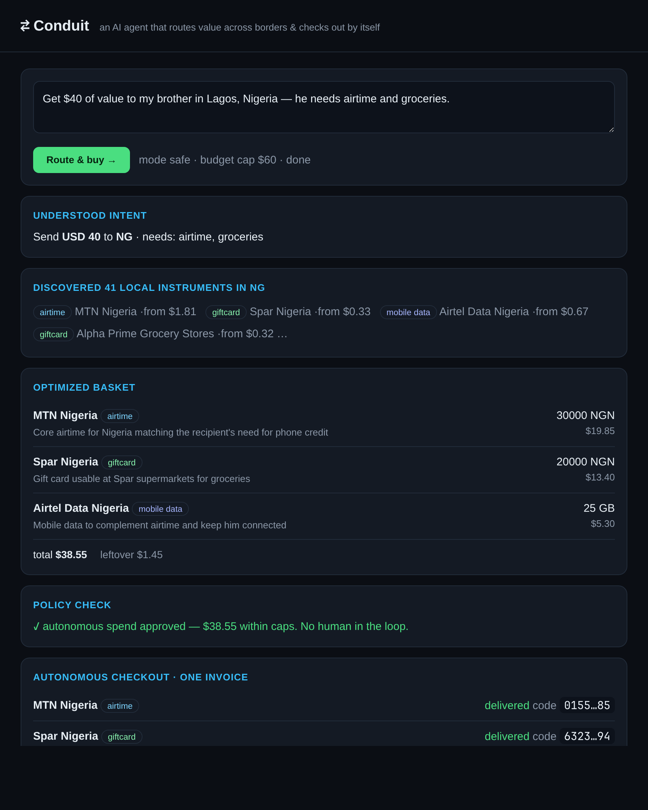

# ⇄ Conduit — a cross-border value-routing agent

**An AI agent that delivers value across borders and checks out by itself.**
Tell it *"get $40 of value to my brother in Lagos"* and it figures out what's
actually **redeemable there** — local airtime, a local supermarket card, mobile
data — assembles the basket, and pays from balance with **no human in the loop**.

Built for the Bitrefill *"AI agents are the next customer"* challenge, on the
Bitrefill Personal REST API (`api.bitrefill.com/v2`), with a free LLM brain.

**This repo ships two agents that share one autonomous-purchase primitive:**
- **⇄ Conduit** — cross-border value routing (below).
- **✦ Aspire** — a goal-driven life planner: tell it a life goal; it safety-checks it,
  reads your (mock) budget + health signals, plans purchases within budget, and
  **autonomously buys the German gift cards that fund them**. See [Aspire](#-aspire--a-goal-driven-life-planner-germ-eur).



<sub>A real captured run: $40 → Lagos. Redemption codes are masked; invoice
`ca7c61cd` delivered all three orders from one balance payment.</sub>

> A US Amazon card is useless in Lagos. Cross-border value delivery is an
> **optimization + fulfillment** problem, not a lookup — pick the right
> *instruments* for the destination, fit them to real denominations and a budget,
> then settle autonomously. Conduit does the whole loop.

---

## The flow

```
intent text ──▶ 1 Intent     LLM → {amount, destination country, needs}
            ──▶ 2 Discover   real instruments for that country (airtime, local
                              gift cards, eSIM, bills) from the Bitrefill API
            ──▶ 3 Optimize   LLM allocates budget across the most locally-useful
                              mix; code snaps each share to a REAL denomination by
                              its true settlement cost (price), never face value
            ──▶ 4 Policy     spend caps replace human approval → truly autonomous
            ──▶ 5 Checkout   ONE multi-item invoice, payment_method=balance,
                              auto_pay; poll each order to delivered; return codes
```

### Why the cost handling is honest
Every Bitrefill package carries `price` — its real cost in the settlement currency
(e.g. 5,000 NGN airtime = $3.26) — alongside the local face `value`. Conduit budgets
against `price`, so cross-currency math needs no FX guessing; the recipient still
sees local face value.

---

## Run it

```bash
uv sync
cp .env.example .env     # set BITREFILL_API_KEY and a free LLM key (LLM_API_KEY)

# Web app (recommended) — watch the agent route + check out live:
uv run uvicorn web.app:app --port 8000      # http://localhost:8000  (about: /landing)

# Headless:
uv run python -m bitrefill_agent.router.engine "Get \$40 to my brother in Lagos, Nigeria"
uv run python -m bitrefill_agent.router.engine "€30 to a friend landing in Tokyo" --live

# Live-debit proof — a real ~$0.18 autonomous purchase, balance before/after:
uv run python -m bitrefill_agent.demo_live
```

A **free, tool-capable LLM** drives intent + allocation. Defaults target OpenRouter
(`openai/gpt-oss-120b:free`); set `LLM_API_KEY`/`LLM_BASE_URL`/`LLM_MODEL` in `.env`.
If the LLM is unavailable, a deterministic fallback still routes (degrades, never
hard-fails).

### Modes & test paths — no real money
- **safe** (default): the **real** basket is planned over the live catalog, but
  checkout runs against a free Bitrefill test product (`delos-syldavia`,
  `test-gift-card-code`) — delivers real redemption codes, spends nothing.
- **live** (`--live`): buys the real basket from balance. With the provisioned
  €20 test credits this is a true account-balance checkout for a few cents.

> Failed/undeliverable orders are auto-refunded; balance is read in EUR minor units
> (2000 = €20.00). Bitrefill's shared test delivery rail is occasionally degraded —
> when it is, the full routing runs and orders come back `permanent_failure`
> (auto-refunded); rerun when it's healthy for delivered codes.

---

## Architecture

```
bitrefill_agent/
  client.py        REST client: Bearer auth, {data} unwrap, BitrefillError
  catalog.py       product search / details / denominations
  purchase.py      buy() + buy_basket() (one multi-item invoice, per-order polling),
                   invoice_settled() (settles on per-order status, not the flaky rollup),
                   mask_code(), redacted audit log (log/transactions.jsonl)
  esim.py extras.py  eSIM + phone/gift primitives
  mcp_compare.py   lists the hosted MCP server's 7 tools (stack comparison)
  router/
    intent.py      free-text intent → RouteRequest (LLM + regex fallback)
    discover.py    instruments for a country, classified, with real costs
    optimize.py    LLM allocation + deterministic denomination fitting → Basket
    policy.py      SpendPolicy — per-route/per-order caps, country allow-list
    execute.py     autonomous checkout (safe | live), fulfillment report
    engine.py      orchestrates and streams progress events
web/
  app.py           FastAPI: POST /api/route streams SSE; serves UI + landing
  static/app.html  the live demo UI
  static/landing.html  the landing page
```

### REST + MCP
The execution engine is REST (full control, balance auto-pays the EUR credits since
EUR is the account's primary sub-account). The hosted **MCP** server is documented and
compared via `uv run python -m bitrefill_agent.mcp_compare` — it lists the official 7
tools live and maps them to our hand-built functions.

## Safety / autonomy
- **Zero humans in the loop**: a `SpendPolicy` (caps + country allow-list) gates every
  purchase instead of an interactive prompt.
- Redemption codes are secrets — masked on screen, redacted in the audit log.
- Every order is logged with invoice id, product, status.

---

## ✦ Aspire — a goal-driven life planner (Germany / EUR)

A second agent on the same purchase primitive. You tell it a **life goal**; it:

1. **Safety-checks** the goal (keyword backstop + LLM classifier) — harmful goals are
   refused with a constructive alternative, never planned or funded.
2. Reads **mock finance + health** signals (`data/mock_*.json`, editable or uploaded) —
   budget becomes a hard cap; health signals tailor the picks.
3. Has a short **clarifying** back-and-forth, then proposes a **plan** of 3–6 concrete
   purchases mapped to real German retailers (Amazon.de, MediaMarkt, IKEA, Decathlon…).
4. **Autonomously buys the gift cards** that fund the plan — one invoice, paid from
   balance — and returns the codes + an itemized shopping list with deep links.

```bash
uv run uvicorn web.app:app --port 8000     # then open http://localhost:8000/planner
uv run python -m bitrefill_agent.planner.demo "get fitter and sleep better"
```

A real captured run (`get fitter and sleep better`, €180/mo budget) delivered four cards
in one invoice — Decathlon €50 (resistance bands + mat), IKEA €30 (lamp), Amazon.de €50
(whey protein), MediaMarkt €50 (white-noise machine) — all `delivered`, plan €153 within
budget, surplus kept as gift-card balance.

> **Honest scope:** Aspire autonomously buys the *gift cards* (the part Bitrefill enables)
> and hands back an itemized shopping list with `amazon.de/s?k=…` deep links — it does not
> drive a real retailer-site checkout (login/ToS). Demo runs in **safe mode** because
> Amazon.de's €50 minimum exceeds the €20 test credits; the mechanic is identical to live.

`bitrefill_agent/planner/`: `safety.py` · `profile.py` · `plan.py` · `converse.py` · `fund.py`.

---

## Submission
- Autonomous purchase: `bitrefill_agent/router/execute.py` (Conduit, multi-item, `auto_pay`)
  and `bitrefill_agent/planner/fund.py` (Aspire, multi-retailer gift-card funding).
- Landing page: `web/static/landing.html`. Demo UIs: `web/static/app.html` (Conduit),
  `web/static/planner.html` (Aspire).
- Demo video script: `DEMO.md`.
- Appendix — this started as a 7-milestone learning build (raw REST → LLM agent);
  that history lives in git.
